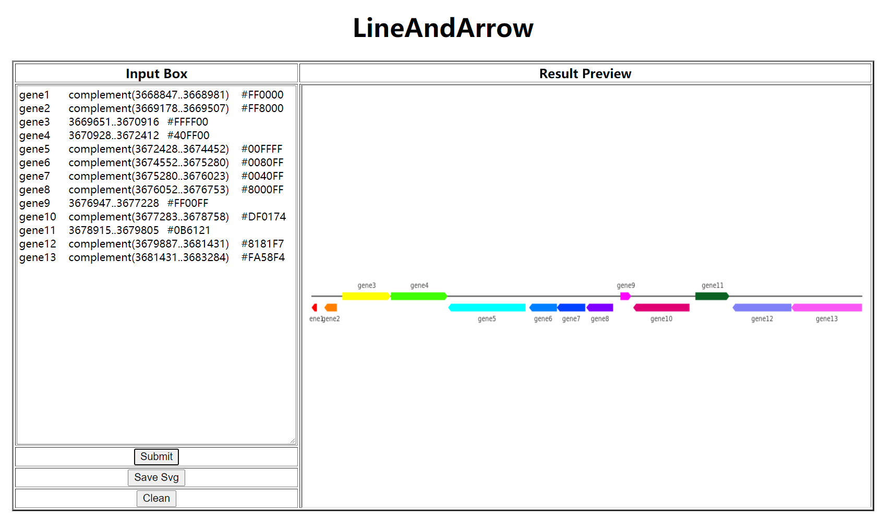

LineAndArrow
===



# Docker
```shell
docker build -t georgezhao/landa:1.0 .
docker run -d -p 1080:1080 georgezhao/landa:1.0
```

# Build the Project
```shell
mkdir build
cd build
cmake -DCMAKE_C_COMPILER=gcc-10 -DCMAKE_CXX_COMPILER=g++-10 ..
make -j
```

# Command Line Args
## LineAndArrow
```
usage: LineAndArrow --input=string --output=string [options] ...
options:
  -i, --input       Path to Input File (string)
  -o, --output      Name of Output. (string)
  -s, --stdout      Print SVG in STDOUT.
      --datapath    Work Path (string [=./])
      --tmppath     Tmp Path (string [=./])
  -?, --help        print this message
```
```shell
# Output to ./o_file.svg
./LineAndArrow --input input_file.data --output o_file
```

## Server
### Lazy Mode
```
usage: server.py [-h] [-e E] [--port PORT]

optional arguments:
  -h, --help   show this help message and exit
  -e E         Path to LineAndArrow.
  --port PORT  Port(Default: 8080)
```
```shell
python3.8 -W ignore -u server.py --port 8080 -e ./LineAndArrow.exe
```

And Then visit: `http://YourAddr:YourPort/LineAndArrow?D=1&Data=YourBase64CodeData`

### Wsgi Mode
Add File named lineandarrow.wsgi:
```
import sys
import os
sys.path.insert(0, 'Path_to_the_folder_of_server/src')
os.chdir('/home/georgezhao/Source/Project/LineAndArrow')
from server import path_to_exe

path_to_exe = '/Path_to_LineAndArrow/LineAndArrow.exe'
from server import app as application
```

Add Config to Your site_config. (e.g. /etc/apache2/sites-enabled/*.conf)
```
WSGIScriptAlias / /Path_to_the_folder_of_wsgi_file/lineandarrow.wsgi

<Directory /Path_to_the_folder_of_wsgi_file>
    AllowOverride None
    Require all granted
</Directory>
<Directory /Path_to_the_folder_of_server>
    AllowOverride None
    Require all granted
</Directory>
```

Restart Your Apache2 server
```shell
sudo service apache2 restart
```

And Then visit: `http://YourAddr:YourPort/LineAndArrow?D=1&Data=YourBase64CodeData`

# Format 
```
geneName    complement(3668847..3668981)	#FF0000
geneName    3668847..3668981	#FF0000
```
